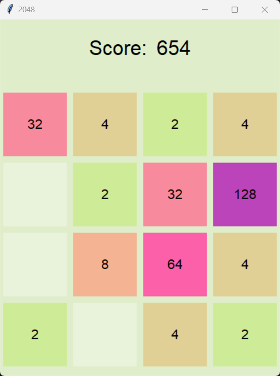

# 2048 game

This is a copy of 2048 game made in Python, using Tkinter library for GUI.

## Table of contents

- [Screenshot](#screenshot)
- [My process](#my-process)
  - [Built with](#built-with)
  - [What I learned](#what-i-learned)
  - [Continued development](#continued-development)
  - [Useful resources](#useful-resources)
- [Author](#author)

## Screenshot

## My process

### Built with

- Python 3.11
- Tkinter

### What I learned

Through coding this project I learned about class inheritance, as I had to get to know how to make the Game class work as a frame. I also got more comfortable with Python, which was a relatively new language for me.

### Continued development

In the future I could add an option of resizing the board (as it would require only making it possible for the user to change one variable), make the game's GUI more interesting or at least less obscure, clean the code and divide it into files so that it's better to read and easier to maintain, or an option to see AI play the game (which would also require implementing the AI).

### Useful resources

- [YouTube - Kite](https://www.youtube.com/watch?v=b4XP2IcI-Bg&ab_channel=Kite) - Useful tutorial on 2048 game in tkinter, Python, that I referred to when I got stuck

## Author

- GitHub - [Martyna Budrewicz - martbudr](https://github.com/martbudr)